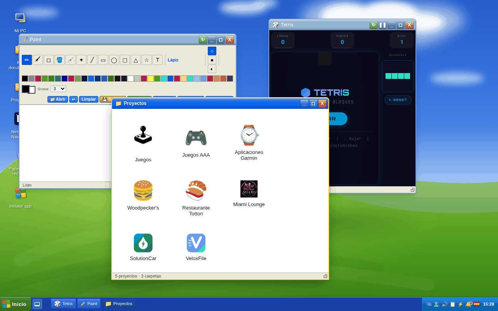
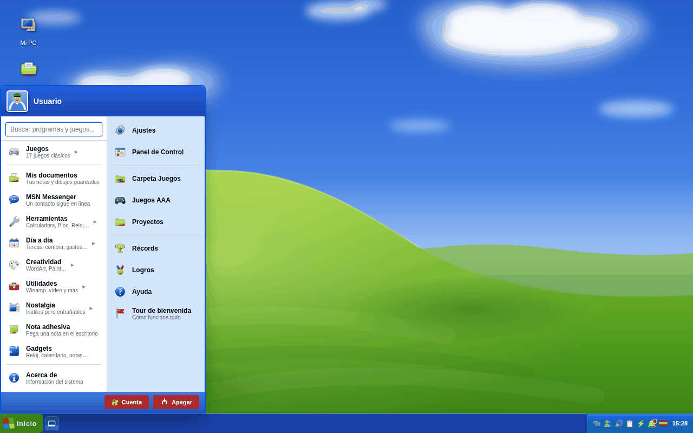
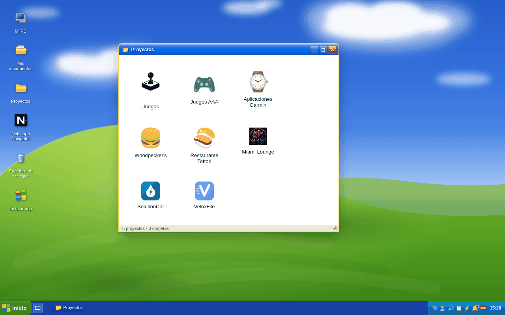
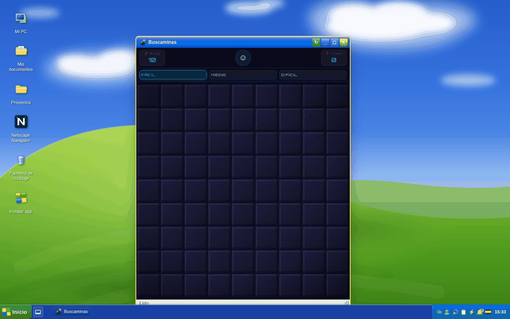
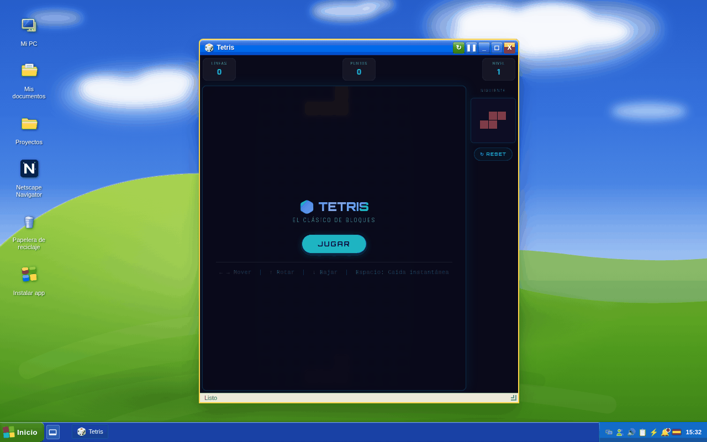
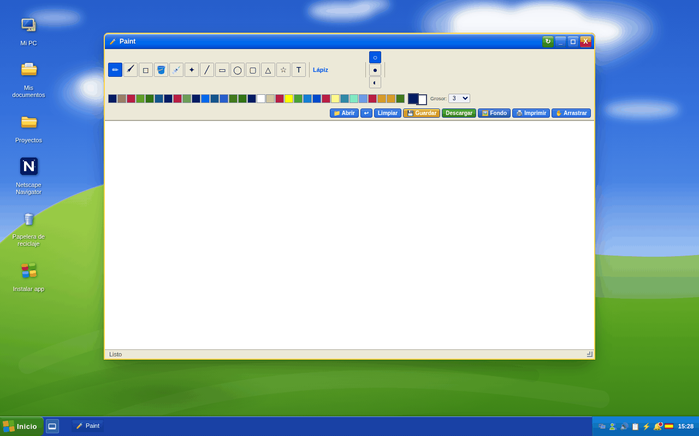
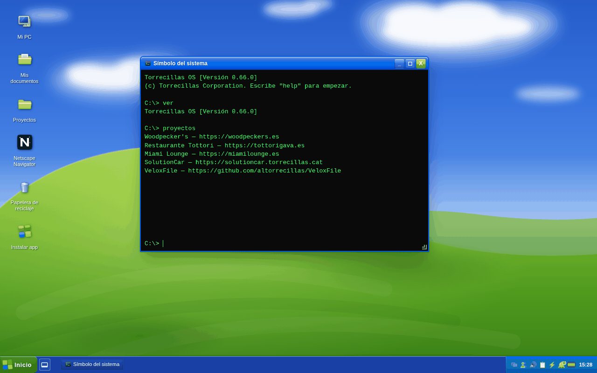
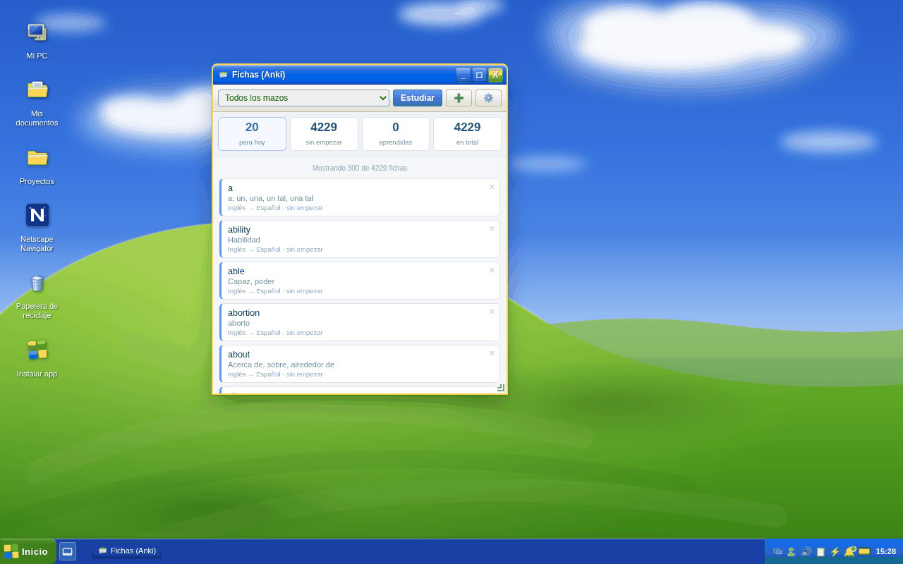

<div align="center">

# Torrecillas OS

**Un escritorio de verdad dentro de una pestaña del navegador.**

Windows XP renacido en HTML: 21 juegos clásicos, ~75 aplicaciones, terminal,
Paint y mi portfolio. Sin instalar nada, sin cuentas, sin servidor.

[](#historial)
[](#instalarlo-como-app)
[](#cómo-está-hecho)
[](#cómo-está-hecho)
[](#idiomas)

### [→ Abrirlo ahora en torrecillas.cat](https://torrecillas.cat/)

</div>



---

## Qué es

No es una imitación con capturas de pantalla: es un escritorio que funciona.
Las ventanas se arrastran, se redimensionan, se minimizan y se apilan; los
iconos se mueven por el escritorio y se tiran a la papelera; la barra de tareas
recuerda lo que tienes abierto y te lo devuelve cuando vuelves.

Todo eso vive en **un solo archivo `index.html`**. Sin React, sin webpack, sin
`npm install`. Lo abres con doble clic y funciona.

## Capturas

<table>
<tr>
<td width="50%"><br><sub><b>El menú Inicio</b> — con buscador: escribes y encuentra juegos, apps y proyectos.</sub></td>
<td width="50%"><br><sub><b>Proyectos</b> — mi portfolio como una carpeta del explorador, con ficha de propiedades.</sub></td>
</tr>
<tr>
<td width="50%"><br><sub><b>Buscaminas</b> — tres dificultades, banderas y cronómetro.</sub></td>
<td width="50%"><br><sub><b>Tetris</b> — bolsa de siete, pieza siguiente y niveles.</sub></td>
</tr>
<tr>
<td width="50%"><br><sub><b>Paint</b> — pinceles, formas, texto, capas de fondo y exportar a PNG.</sub></td>
<td width="50%"><br><sub><b>Símbolo del sistema</b> — con <code>help</code>, <code>ver</code>, <code>proyectos</code> y unos cuantos secretos.</sub></td>
</tr>
<tr>
<td colspan="2"><br><sub><b>Fichas de estudio</b> — repaso espaciado estilo Anki, con 4.229 palabras de inglés→español de serie e importación de <code>.apkg</code>.</sub></td>
</tr>
</table>

## Qué hay dentro

### 21 juegos

Snake · Tetris · Flappy Bird · Arkanoid · Invaders · Buscaminas · Pong · 2048 ·
Tres en raya · Conecta 4 · Memoria · Solitario · Pinball · Sudoku · Simon ·
Ajedrez · Mahjong · Damas · Reversi · Ahorcado · Sopa de letras

Los 21 guardan marca en el **Salón de la fama**, con récord separado por
dificultad donde tiene sentido (Buscaminas, Sudoku, Mahjong y Sopa de letras).

### ~75 aplicaciones

| | |
|---|---|
| **Clásicos de la época** | Paint, Bloc de notas, Calculadora, WordArt, MSN Messenger, Winamp, Outlook Express, Netscape Navigator, eMule, Encarta 99, Regedit, Desfragmentador, Loquendo |
| **Día a día** | Tareas, Lista de la compra, Gastos, Gastos compartidos, Agenda, Recetas y menú semanal, Hábitos, Notas en Markdown, Hoy |
| **Utilidades** | Hoja de cálculo, Graficadora de funciones, Conversor de unidades, Tabla periódica, Calculadoras de hipoteca/IVA/%/fechas, Comparador de precio por unidad, Validador de NIF/NIE/CIF/IBAN, Generador de QR y lector, Gestor de contraseñas, Carpetas ZIP, Escáner a PDF |
| **Creatividad** | Retoques de imagen, Pixel Art, Generador de memes, Caja de ritmos, Piano, Caleidoscopio, Photo Booth, Grabadora |
| **Del mundo real** | El tiempo, Aviso de lluvia por radar, Precio de la luz (PVPC), Precio de la gasolina, Calidad del aire, Escáner de etiquetas de productos |
| **Lectura y estudio** | Lector de EPUB y PDF, Fichas de estudio (Anki) |

### Mi portfolio

La carpeta **Proyectos** reúne webs de clientes, mis 6 juegos web publicados
aparte y mis 6 apps y esferas en la tienda **Garmin Connect IQ**. Cada ficha
tiene su diálogo de propiedades al estilo XP.

## Instalarlo como app

Es una PWA completa. En el navegador aparecerá el botón de instalar (o tienes el
icono **Instalar app** en el escritorio).

Una vez instalada:

- **Funciona sin conexión.** Entera. Los juegos, las notas, el lector, todo.
- **Atajos en el icono.** Pulsación larga y vas directo a Tareas, Lista de la
  compra, Gastos o Notas.
- **Compartir con la app.** Mandas una imagen, un EPUB, un PDF, un texto o un
  enlace desde cualquier sitio del móvil y se abre aquí.
- **Abre archivos.** Los `.epub` y `.pdf` del sistema se pueden abrir con
  Torrecillas OS.

### Actualizaciones

El *service worker* nunca se activa a la brava. Cuando hay versión nueva se
queda **en espera** y la página te ofrece un botón *Actualizar*: así una ventana
que llevas abierta no se queda con el JavaScript viejo y los recursos nuevos
mezclados.

## Tus datos son tuyos

No hay servidor, no hay analítica, no hay cuentas. Todo lo que escribes se queda
en el `localStorage` de tu navegador.

Si quieres, puedes crear una **cuenta local cifrada**: se protege con una
contraseña y todo lo guardado se cifra con **PBKDF2 + AES-GCM** dentro del
propio navegador. También puedes exportar e importar tus datos como un archivo,
en claro o cifrado.

### Sincronizar entre tus dispositivos (opcional)

Sigue sin haber servidor: en **Ajustes → Sincronización** enlazas una carpeta
del disco (puede ser una que ya sincronicen Dropbox, Drive o OneDrive) y ahí se
guarda un fichero cifrado con el mismo formato que la copia de seguridad
manual. Aviso honesto: usa la *File System Access API*, así que solo funciona
en Chrome, Edge u Opera de escritorio y Android — no en Firefox ni en
Safari/iPhone.

## Idiomas

Español, inglés, catalán y ruso. Se detecta el del navegador y se puede cambiar
en Ajustes.

## Cómo está hecho

**Un archivo. Cero dependencias. Cero build.**

```
index.html              todo: HTML, ~300 KB de CSS y ~1,5 MB de JavaScript
sw.js                   service worker (caché y actualizaciones)
manifest.webmanifest    identidad de la PWA, atajos y share target
fonts/                  Orbitron y Rajdhani en woff2
icon-*.png, og.png      iconos e imagen para redes
tools/                  scripts sueltos para generar iconos y recursos
docs/capturas/          las capturas de este README
```

Nada de framework: JavaScript a pelo con el DOM. Suena a mucho para 2 MB, pero
se sirve en **575 KB comprimido**, pinta el primer contenido en **~300 ms** y el
navegador tarda **26 ms** en parsear todo el JavaScript. Que sea un solo archivo
es justo lo que hace que funcione sin conexión desde el primer segundo.

Detalles que quizá te interesen si abres el código:

- **Vanilla y comentado en español.** Los comentarios explican *por qué* está
  hecho así, no *qué* hace la línea.
- **Estrategia de caché** *stale-while-revalidate* para todo, documento
  incluido: la copia guardada se pinta al instante y el refresco va por detrás.
  Las fuentes y los iconos se sirven como inmutables dentro de cada versión.
- **Los datos estructurados** (JSON-LD de schema.org) van escritos a mano en el
  HTML para los rastreadores que no ejecutan JavaScript.

### Trastear con él

No hace falta nada instalado. Como el *service worker* y el manifest necesitan
un origen `http(s)`, levanta un servidor cualquiera:

```bash
python3 -m http.server 8000
# y abre http://localhost:8000
```

Para publicar: sube los archivos tal cual. Es estático.

> [!IMPORTANT]
> Al desplegar, sube `APP_VERSION` **en los dos sitios a la vez**:
> `index.html` y `sw.js`. Si no coinciden, el aviso de actualización no salta.

## Historial

La versión vive en `APP_VERSION`. La actual es la **0.68.0**.

---

<div align="center">

Hecho con cariño y mucha nostalgia por **[Alejandro Torrecillas](https://torrecillas.cat/)**

<sub>Windows XP y Bliss son marcas de Microsoft. Esto es un homenaje sin ánimo de lucro.</sub>

</div>
